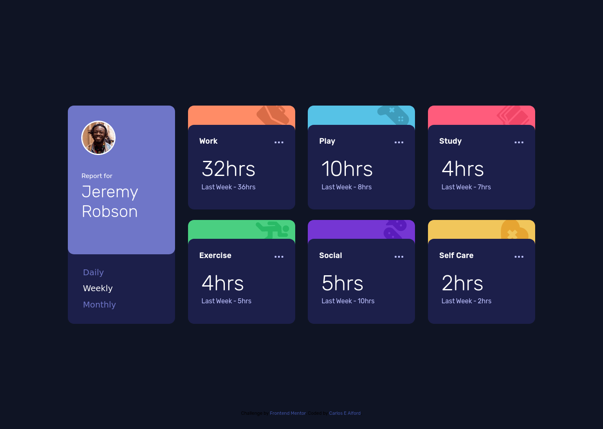

# Frontend Mentor - Time tracking dashboard solution

This is a solution to the [Time tracking dashboard challenge on Frontend Mentor](https://www.frontendmentor.io/challenges/time-tracking-dashboard-UIQ7167Jw). Frontend Mentor challenges help you improve your coding skills by building realistic projects.

## Table of contents

- [Overview](#overview)
  - [The challenge](#the-challenge)
  - [Screenshot](#screenshot)
  - [Links](#links)
- [My process](#my-process)
  - [Built with](#built-with)
  - [What I learned](#what-i-learned)
  - [Continued development](#continued-development)
  - [Useful resources](#useful-resources)
- [Author](#author)
- [Acknowledgments](#acknowledgments)

## Overview

### The challenge

Users should be able to:

- View the optimal layout for the site depending on their device's screen size
- See hover states for all interactive elements on the page
- Switch between viewing Daily, Weekly, and Monthly stats

### Screenshot



### Links

- Solution URL: [Github Repo](https://github.com/CarlosEAM/frontend-mentor-my-solutions/tree/main/time-tracking-dashboard)
- Live URL: [Tip Calculator Site](https://carloseam.github.io/frontend-mentor-my-solutions/time-tracking-dashboard/dist/)

## My process

### Built with

- Semantic HTML5 markup
- CSS custom properties
- Flexbox
- CSS Grid
- Mobile-first workflow
- JavaScript
- [SASS](https://sass-lang.com/)
- [Webpack](https://webpack.js.org/)

### What I learned

I learn about webpack. How to create a webpack configuration file which
takes multiple entries and creates a bundle using a combination of HTML, SASS and JS. Here is a little snippet:

```js
module.exports = {
  entry: './src/index.js',
  output: {
    filename: 'main.js',
    path: path.resolve(__dirname, 'dist')
  },
  mode: 'development',
  plugins: [].concat(devMode ? [] : [new MiniCssExtractPlugin()]),
  module: {
    rules: [
      {
        test: /\.(sa|sc|c)ss$/i,
        use: [
          // Created 'style' nodes from JS strings or extract to separate file
          devMode ? 'style-loader' : MiniCssExtractPlugin.loader,
          // Traslates CSS into commonJS
          "css-loader",
          // Compiles SASS to CSS
          "sass-loader"
        ]
      }
    ]
  }
};
```

### Continued development

Webpack is really useful and makes the development process a lot
easier. By automating some tasks you save a lot of time. However this
is something which still new to me so will have to spend more projects
working to improve my knowledge.

### Useful resources

- [SASS documentation](https://sass-lang.com/documentation) - This is a great resource to learn and use as reference.
- [Webpack](https://webpack.js.org/concepts/) - Another great resource.
The documentation taught me with examples how to do some tasks.
It has a lot of good examples.

## Author

- Website - [Carlos E Alford M](https://carlosealford.com)
- Frontend Mentor - [CarlosEAM](https://www.frontendmentor.io/profile/CarlosEAM)
- Twitter - [@webshuriken](https://www.twitter.com/webshuriken)

## Acknowledgments

My acknowledgment goes out to all those people working hard.
It is the grind which makes things like SASS and Webpack come to be.

Thanks to you all. Also for taking the time to document it, even
if sometimes the documents could do with better explanations. :smile:
